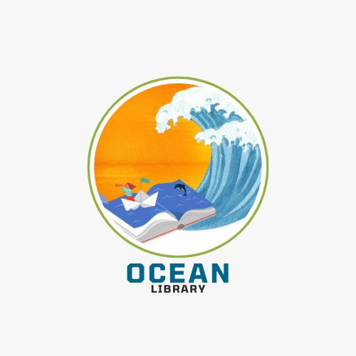

<p align="center">
  <a href="https://getbootstrap.com/">
    
  </a>
</p>

## TABLA DE CONTENIDOS

- [Proyecto](#sobre-nuestro-proyecto)
- [Ocean Library](#oceanlibrary)
- [Instrucciones](#instrucciones)
- [¿Qué necesitas?](#que-necesitas)
- [Instalación](#instalación)
- [Realizado con](#realizados-con)
- [Versión](#version)
- [Autores](#autores)
- [Licencia](#licencia)

## SOBRE NUESTRO PROYECTO.

_Este proyecto implica la creación de una biblioteca de estilos Bootstrap que implemente estilos personalizados para el desarrollo web, así como la creación de una página web que resalte la implementación y el comportamiento de nuestra propia biblioteca de estilos._

## OCEANLIBRARY.

_Nuestra librería está inspirada en una paleta de colores oceánicos, utilizando por ejemplo: Colores RGB de fondo, borde, sombras, con diseños flexibles para poder implementarlos a través de contenedores flexibles y una implementación de filas y columnas de fácil entendimiento e implementación, así como diversas propiedades como colores de fondo, tipos de texto, bordes, paddings y algunas clases para definir por ejemplo: barras de navegación, formularios, alertas, tarjetas, contenedores etc. Espero te sea de agrado y utilidad._

## INSTRUCCIONES.

_Esto te permitirán obtener una copia del proyecto en funcionamiento en tu máquina local para propósitos de desarrollo y pruebas._

```
1.	Acceder a la dirección del GitHub teniendo los permisos como colaborador para acceder a los archivos.
2.	Dirigirse al apartado de CODE (en color verde) y copiar el link del repositorio.  
3.	Dirigirse al entorno de desarrollo en este caso (VISUAL STUDIO). 
4.	Crear una carpeta de manera local en el directorio de tu computadora. 
5.	Estando en la carpeta, abrir la consola con crtl +ñ y agregar el siguiente comando "git clone + link del repositorio". 
6.	Le damos aceptar y ya tendríamos el repositorio en nuestro ordenador.
```

## ¿QUÉ NECESITAS?

_Tener instalado en tu maquina los siguientes componentes:_

```
- Un editor de texto.
- Node.js para compilar codigo en SASS.
- Instalación previa de SASS.
```

## INSTALACIÓN.

_El directorio debe ser copiado en la carpeta donde tendrás tu propio archivo index.
Para importar las librerías, debes incluir el archivo style.css que es donde se encuentran todos los archivos SASS compilados, se hace de la siguiente manera:_

```
<head>
    <link rel="stylesheet" href="/OceanLibrary/scss/style.css">
    <title>Document</title>
</head>
```
_Donde OceanLibrary es la carpeta del proyecto._

## REALIZADOS CON:

* [Visual Studio Code](https://code.visualstudio.com/) - Editor de texto utilizado para codificar la libreria.
* [Node.js](https://nodejs.org/en) - Usado para compilar codigo en SASS

## VERSIÓN

_Ocean Library versión actual 1.0_

## AUTORES.

* Andrade Campos, Osiris Ivania – AC21059. - [Osiris30](https://github.com/Osiris30)
* Castillo Portillos, Miriam Isabel – CP21026. - [isabeCastillo](https://github.com/isabeCastillo)
* Hernández Arias, Alisson Andrea – HA21011. - [alissonhernandez](https://github.com/alissonhernandez)
* Moreno Santiago, Dayna Rebeca – MS21017. - [Rebecamo](https://github.com/Rebecamo)

## LICENCIA.

Este proyecto está bajo la Licencia (OceanLibrary License 2024) - puedes observar para mayor información [LICENSE.md](LICENSE.md).
